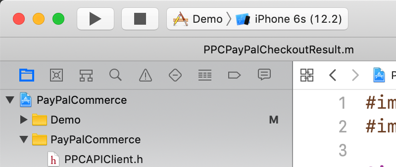

# PayPalCommercePlatform

## Note
This repository is currently in development. The PayPal Commerce Platform SDK is not meant for public use. The repo is public for pilot merchants only.

## About
PayPalCommercePlatform provides a native SDK offering to current PayPal partners. It allows existing PayPal partners to use Apple Pay and to get the benefits of Three D Secure verification. This module provides an “unbranded” checkout experience to merchants already integrated with PayPal. The prerequisite for using this module is that the merchant already has an existing PayPal server integration using Orders V2. Their server must be able to generate a PayPal client auth token and complete transactions using the PayPal backend.

## Running the Demo App

- Inside of your cloned repo, run `pod install` to install project dependencies. Here are [instructions to install CocoaPods](https://guides.cocoapods.org/using/getting-started.html) if you don't already have it.

- Make sure to now open the **Xcode workspace** instead of the project file when going to build/run the project. This is called `PayPalCommercePlatform.xcworkspace`.

- Choose the `Demo` app target from the drop-down menu before clicking the run/play button to run the app. Choose the simulator appropriate for your testing needs. See screenshot below.
  - 

- *Note:* When testing the PayPal flow, we notice that Xcode 11 simulators sometimes act buggy when displaying an `SFSafariViewController`. The screen will sometimes go entirely white and flicker.
  - In toolbar at the top of the Xcode simulator, click `Hardware > Erase All Content and Settings`. Also, try testing on a different simulator iPhone model and iOS version.

## Xcode
Running this repo's Demo app requires Xcode 11+, due to our inclusion of [`InAppSettingsKit Framework`](https://github.com/futuretap/InAppSettingsKit).
