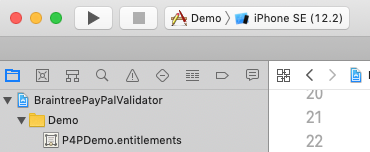

# BraintreePayPalValidator

## Note
This repository is currently in development. The BraintreePayPalValidator SDK is not meant for public use. The repo is public for pilot merchants only.

## About
BraintreePayPalValidator provides a native SDK offering to current PayPal partners. It allows existing PayPal partners to use Apple Pay and to get the benefits of Three D Secure verification. This module provides an “unbranded” checkout experience to merchants already integrated with PayPal. The prerequisite for using this module is that the merchant already has an existing PayPal server integration using Orders V2. Their server must be able to generate a PayPal client auth token and complete transactions using the PayPal backend.

## Running the Demo App

- Make sure to now open the **Xcode workspace** instead of the project file when going to build/run the project. This is called `BraintreePayPalValidator.xcworkspace`.

- Choose the `Demo` app target from the drop-down menu before clicking the run/play button to run the app. Choose the simulator appropriate for your testing needs. See screenshot below.

